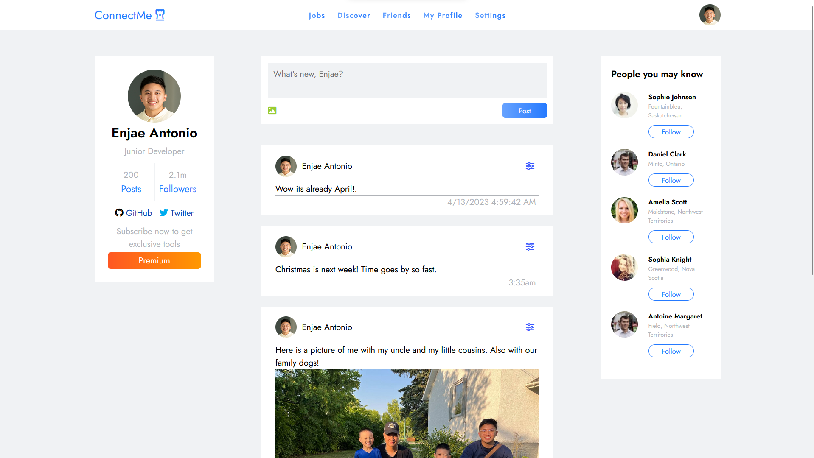

# <h1 align="center">ConnectMe :iphone: </h1>

### Table of contents
- [Demo](https://enjaeantonio.github.io/connect-me)
- [Login Page](#Login-page)
- [Home Page](#Home-page)


## Introduction :wave:
ConnectMe is a mock **Social Networking Platform** designed to bring people together, help them share their thoughts, and discover new connections. 


## Login Page 


- This section contains a form for users to enter their email and password to login, or create a profile if they do not have one. 
- It also includes some styling elements like a gradient line and icons for email, password, and an eye for password visibility. 


### LocalStorage 
- Users can **create** a profile by saving their email and password to local storage. 
- Error messages are displayed for invalid input, and success messages are displayed for successful login or profile creation.
- It also **retrieves** the user's email and password input, validates the input, and checks if the credentials match those saved in local storage. 

```JavaScript 
onEvent('click', loginBtn, function(event){
        if((userEmail.value === '' && userPassword.value === '')){
        errorOutput.innerText = 'Login credentials Invalid!'
        }
        event.preventDefault();
        loginInfo.forEach(element => {
                if(userEmail.value === element.email && userPassword.value === element.password) {
                loadScreen.classList.remove('hidden');
                       setTimeout(() => {
                        window.open(
                                './home.html',
                                '_blank'
                              );
                              loadScreen.classList.add('hidden');

                       }, 2000) 
                        errorOutput.innerText = 'Success!';
                }else {
                        errorOutput.innerText = 'Email or password is invalid!';
                }
        });
});


const loginInfo = JSON.parse(localStorage.getItem('loginInfo')) || [];

onEvent('click', createBtn, function(event){
        event.preventDefault();
      
        const login = {
                email: userEmail.value,
                password: userPassword.value
        }

        if(userEmail.value == '' && userPassword.value == '') {
                errorOutput.innerText = 'Credentials empty!'
        }else if(!emailRegex.test(userEmail.value)) {
                errorOutput.innerText = 'Email Invalid!';
        } else if (userPassword.value == '') {
                errorOutput.innerText = 'Enter a valid password!';
        } else {
                loginInfo.push(login);
                localStorage.setItem('loginInfo', JSON.stringify(loginInfo));
                errorOutput.innerText = 'Profile created!';
        }
});
```


##  Home Page
- This code controls the behavior of a **social media website**. It allows users to create posts containing text or image content and displays the post on the webpage. 





### RandomUser API 
- Retrieves random user data from the **https://randomuser.me** API and displays it on a webpage. 
- The **getUser()** function sends a GET request to the API, with parameters to request data from Canada and to retrieve 10 results. 
- The response data is then converted to a **JSON** object, which is passed to the randomUser() function. 
- The randomUser() function extracts the necessary data from the **response object**, creates a new div element with the extracted data, and appends it to the HTML DOM. The appended div element includes a user's picture, name, and location. 
``` JavaScript
    function getUser(){

const url = `https://randomuser.me/api/?nat=CA&results=10&`;
const options = {
        method: 'GET',
        mode: 'cors'
     };
        fetch(url, options)
          .then((result) => {
                return result.json();
        })
          .then((data) => {
                randomUser(data);
        });
      };

getUser();

function randomUser(randomUser){

const users = randomUser.results;

        users.forEach(element => {
                let genUserDiv = create('div');
                genUserDiv.className = 'gen-users';

               genUserDiv.innerHTML = `
               
                   <div class="gen-desc">
                       <h2>${element.name.first} ${element.name.last}</h2>
                       <p>${element.location.city}, ${element.location.state}</p>
                       <button class="gen-follow">Follow</button>

                   </div>
               `
               genParent.append(genUserDiv)
               
        });
      };

```
